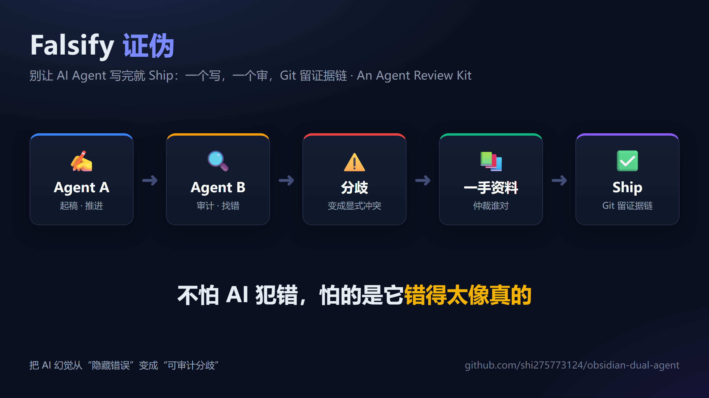
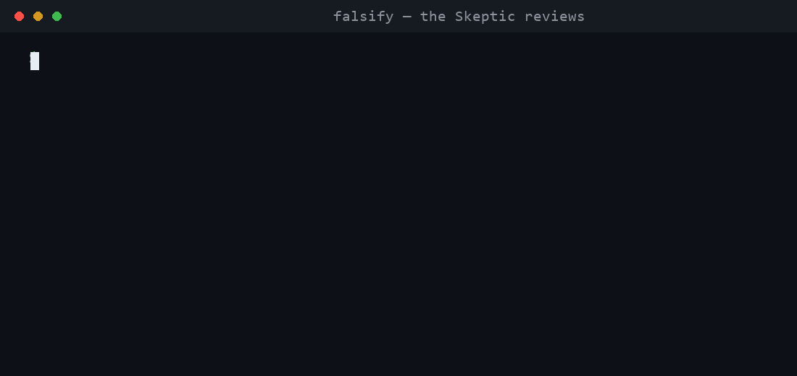

# Falsify

> **Your unfair advantage.** Drop in one prompt; two top AIs cross-examine it; you keep only the conclusion that survives.
> You move once, they fight it out. Spends tokens, saves your brain.

[](https://github.com/shi275773124/obsidian-dual-agent/actions/workflows/falsify.yml)
[](./LICENSE)
[](./README.zh-CN.md)

[中文版](./README.zh-CN.md) · [Setup](./docs/02-setup.md) · [Layer 1 · Peer Review](./docs/03-collaboration.md) · [Layer 2 · Adversarial Review](./docs/05-adversarial-review.md)

<p align="center">
  
</p>

> 🙏 Thanks to **Hermes Agent**, **Claude Code**, and **Codex** — the tooling this workflow was built and tested on.

---

A single AI writes it; you have to verify it. **Falsify makes a second, different top model take its work apart** — wrong numbers and unsupported conclusions get caught before they reach your eyes. One drafts, one audits, Git keeps the evidence trail.

<p align="center">
  
</p>

> A real run: a DeepSeek model as the Skeptic audits a draft, catches every seeded error, returns `Verdict: HOLD`. Verbatim transcript: [examples/.../06](./examples/comparison-case-study/06-real-review-deepseek.md).

---

## Why it's worth it

- **Less effort** — one round of work, a report two top minds already vetted.
- **1 + 1 > 2** — two different models check each other; one's blind spot is the other's catch.
- **Provable trust** — it really catches errors a single model would have shipped (below).

---

## Real case: 4 errors that would have shipped, caught by the second AI

Two independent agents (different models) ran a horizontal comparison of **~12 competing venues** (names redacted). One draft, one audit, a report in **under 30 minutes**: 80+ cited URLs, and **Agent B caught 4 critical pricing errors** that would have shipped without it.

| Caught | Single agent | After dual-agent review |
|---|---|---|
| Venue A fee copied from a peer | Wrong by 2×, looks complete | B flags, resolves against docs |
| Venue B VIP0 maker sign flipped | Rebate written as a charge | B re-checks fee schedule |
| Venue C premium tier "not public" | Actually in the docs | B verifies, marks conflict |
| Venue D base fee wrong row | Wrong row in the table | B audits, requires source |

> Not a perfect AI — just errors that **can't ship quietly**.

---

## One command

```bash
pip install -e .                       # or just python falsify.py
export DEEPSEEK_API_KEY=sk-...         # or OPENAI_API_KEY / OPENROUTER_API_KEY…
falsify review report.md -p deepseek   # a second model audits it -> Verdict (PROCEED/HOLD/ARCHIVE)
```

`-p` is a provider preset (deepseek / openai / openrouter / moonshot / siliconflow / local) that fills in the endpoint and model — **you only supply the key**. Tired of typing it? `falsify init` saves it once, then just `falsify review report.md`; or `cat report.md | falsify review -` to paste-and-go.

`review`'s **exit code is the Verdict** (`PROCEED=0 / HOLD=1 / ARCHIVE=2`) — drop it straight into CI.
Try `lint` with no key (pure local):

```bash
falsify lint examples/comparison-case-study/05-final-excerpt.md   # → SHIPPABLE
```

---

## Two layers

- **[Layer 1 · Peer Review](./docs/03-collaboration.md)** — catches **wrong numbers** (cheap, default): tag every paragraph, don't overwrite the other agent, conflicts go to first-hand sources.
- **[Layer 2 · Adversarial Review](./docs/05-adversarial-review.md)** — catches **wrong conclusions** (high-stakes): verdict ladder (`PROCEED/HOLD-N/ARCHIVE`) + multi-round + G1–G4 gates + cross-model independence.

| | Layer 1 | Layer 2 |
|---|---|---|
| Catches | wrong facts | right facts + wrong conclusion |
| In one line | "is this number right?" | "what makes this conclusion hold?" |

---

## What else is in here

- [`templates/`](./templates/) — ready to use: `AGENTS.md`, three prompts, kickoff/retro, conflict/resolution logs, CI template
- [`demo-vault/`](./demo-vault/) — forkable empty workspace; edit `00-brief.md` and go
- [`examples/comparison-case-study/`](./examples/comparison-case-study/) — sanitized end-to-end sample + one real run
- [`docs/`](./docs/) — [architecture](./docs/01-architecture.md) · [setup](./docs/02-setup.md) · [Layer 1](./docs/03-collaboration.md) · [Layer 2](./docs/05-adversarial-review.md) · [troubleshooting](./docs/04-troubleshooting.md)

---

## Roadmap

- [x] CLI engine `falsify` (lint / review / verdict gate)
- [x] Forkable demo vault · sanitized case · flow card · real-run GIF
- [x] One-click: provider presets (`-p deepseek`) / `.falsify` config / paste-and-go
- [x] GitHub Action: block a PR that doesn't pass the verdict ([`templates/github-action-falsify.yml`](./templates/github-action-falsify.yml))
- [ ] More scenario templates: research / competitor / tech selection / code audit

## Contributing

Welcome: new scenario templates, sanitized case studies, sharper prompts, more agent-runner examples, translations. Fork → small focused change → PR (name the pain you're solving). Open an Issue to discuss first.

---

## License

MIT — fork it, ship it, write a blog post about it.

<details>
<summary>Support</summary>

- 🐦 [@aishikejian](https://x.com/aishikejian) · ☕ [Buy me a coffee](https://buymeacoffee.com/chris168) · ⭐ Star it
- 🪙 ETH / USDT-ERC20 / any EVM: `0x1C06DeC922015ee7817aC21d37Da2da2F07d7119`

</details>
