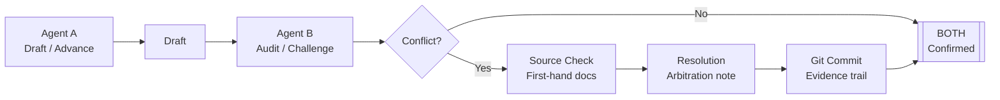

# Agent Review Kit

> Give AI agents a review loop: one drafts, another audits, Git keeps the evidence trail.

[](https://github.com/shi275773124/obsidian-dual-agent/actions/workflows/link-check.yml)
[](./LICENSE)
[](./README.zh-CN.md)

[中文版](./README.zh-CN.md) · [Architecture](./docs/01-architecture.md) · [Setup](./docs/02-setup.md) · [Collaboration Rules](./docs/03-collaboration.md) · [Troubleshooting](./docs/04-troubleshooting.md)

> 🙏 Thanks to **Hermes Agent**, **Claude Code**, and **Codex** — the agent tooling this dual-agent workflow was built and tested on.

---

Make AI hallucinations reviewable: turn hidden errors into explicit disagreements, then resolve them with first-hand sources.

---

## The problem with single-agent research

It's not that the agent can't write.

The problem is it writes *too well*. It packages a wrong number, an outdated reference, or an unsupported claim into a confident, well-structured paragraph that looks exactly like correct output.

**Agent Review Kit** changes that:

> One agent drafts. Another agent audits. Every change goes into Git. Every disagreement goes to first-hand sources.

This is a **Dual-Agent Peer Review Protocol** — a workflow, not a plugin:

- **Agent A**: drafts, researches, advances
- **Agent B**: audits, challenges, finds errors
- **Git**: records every change
- **Obsidian**: human reading and search layer (optional)
- **First-hand sources**: final arbiter — official docs, APIs, source code, whitepapers

One sentence:

> **Turn AI hallucinations from hidden errors into auditable disagreements.**

---

## Real case: Agent B caught 4 errors before they shipped

Two independent agents ran a horizontal comparison of **~12 competing venues** in
one category — fee schedules and incentive-program data. (Venue names and the
specific vertical are redacted; the point is the method, not the targets.)

- Agent A drafted the report
- Agent B audited every section
- Conflicts went to official docs, API responses, source code
- Git tracked the full process

Result:

- Total time: ~6 hours
- Final report: 80+ cited source URLs
- Agent B caught: **4 critical pricing errors**

| Error caught | Without Agent B | With dual-agent review |
|---|---|---|
| Venue A fee tier copied from a peer | Wrong by 2×, table looks complete | B flagged, resolved against official docs |
| Venue B VIP0 maker direction flipped | Rebate written as a charge, enters report | B verified fee schedule, required correction |
| Venue C premium tier "not public" | Actually in the docs, abandoned too early | B independently verified, marked conflict |
| Venue D base fee wrong row | Wrong row in cross-venue comparison | B audited table, required source confirmation |

> **The goal isn't a perfect AI. It's making AI errors harder to hide.**

---

## Before / After

| Single-agent workflow | Agent Review Kit |
|---|---|
| One agent writes, you trust it | One agent writes, another audits |
| Errors hide in polished prose | Errors become explicit conflicts |
| Sources may not support conclusions | Every dispute goes to first-hand sources |
| Changes are invisible | Git keeps the full trail |
| Human reads the whole thing | Human focuses on conflict zones |
| Ship when it "looks right" | Ship after `[BOTH]` confirmed |

---

## Architecture



---

## 5-minute quickstart

```bash
# 1. Create a private GitHub repo (call it whatever)

# 2. On Agent A's host
git clone git@github.com:you/your-vault.git
cd your-vault
cp /path/to/this-repo/templates/AGENTS.md ./AGENTS.md
cp /path/to/this-repo/templates/.gitignore ./.gitignore
git add . && git commit -m "init: dual-agent rules" && git push

# 3. On Agent B's host
git clone git@github.com:you/your-vault.git
# uses the same AGENTS.md

# 4. On your laptop (optional — for human reading)
git clone git@github.com:you/your-vault.git "$HOME/Documents/Obsidian Vault"
# Open in Obsidian → install Obsidian Git plugin → set auto pull/push
```

Full step-by-step: [docs/02-setup.md](./docs/02-setup.md)

---

## Three rules (memorize these)

1. **Tag every paragraph**: `[AGENT-A]`, `[AGENT-B]`, or `[BOTH]`. No untagged prose.
2. **Don't overwrite the other agent's blocks.** Add your own block underneath. Use `[AGENT-B audit]` for inline audit notes.
3. **Conflicts go to first-hand sources.** A says 4.5bps, B says 9.0bps — neither wins by assertion. Open the official docs URL, paste the quote, cite it.

---

## Tag reference

```
[AGENT-A]         Agent A's original draft content
[AGENT-B]         Agent B's added content
[AGENT-B audit]   Agent B's audit note on Agent A's content
[BOTH]            Agreed conclusion — safe to ship
[CONFLICT]        Unresolved disagreement — do not ship
[RESOLUTION]      Arbitrated conclusion with first-hand source
[NEEDS-SOURCE]    Source required, not yet trusted
[NEEDS-AUDIT]     Flagged for Agent B review
```

---

## Commit convention

```
draft(agent-a):   add initial perp dex fee table
audit(agent-b):   flag rebate sign conflict
resolve(human):   settle lighter fee sign using official docs
verify(agent-b):  confirm hyperliquid vip0 fee tier
docs(human):      finalize report after review
```

---

## What's in this repo

```
.
├── README.md                    (you are here)
├── README.zh-CN.md              Chinese version
├── docs/
│   ├── 01-architecture.md       why and how it works
│   ├── 02-setup.md              VPS + laptop step-by-step
│   ├── 03-collaboration.md      tagging, conflict resolution
│   └── 04-troubleshooting.md    git conflicts, plugin issues
├── templates/
│   ├── AGENTS.md                drop into your vault root
│   ├── .gitignore               sensible Obsidian defaults
│   ├── obsidian-git-settings.md plugin config snippet
│   ├── conflict-log.md          conflict tracking template
│   ├── resolution-log.md        resolution tracking template
│   └── prompts/
│       ├── agent-a.md           Agent A full prompt
│       ├── agent-b.md           Agent B full prompt
│       └── human.md             Human Operator prompt
├── examples/
│   └── comparison-case-study/
│       └── README.md            Sanitized horizontal-comparison case study
└── LICENSE                      MIT
```

---

## What this is not

- Not a magic prompt that makes AI smarter
- Not a zero-error guarantee
- Not Obsidian-specific (any Markdown editor works)
- Not tied to a specific agent framework

It's a **protocol**: author tagging, conflict handling, and audit trail requirements for AI research collaboration.

---

## Roadmap

- [ ] Forkable demo vault
- [ ] Full case study: ~12-venue horizontal research postmortem (sanitized)
- [ ] Real conflict samples: A drafts wrong, B catches it, docs arbitrate
- [ ] Claude Code usage example
- [ ] Cursor usage example
- [ ] OpenCode usage example
- [ ] Hermes Agent dual-profile example
- [ ] Single vs dual agent error-catch comparison
- [ ] More scenario templates: investment research, competitor analysis, tech selection, code audit, product research
- [ ] Long-form writeup: Dual-Agent Peer Review Protocol

---

## License

MIT — fork it, ship it, write a blog post about it.

---

## Support the project

If this saved you a few hours:

- 🐦 Follow [@aishikejian](https://x.com/aishikejian) on X — more dual-agent / AI ops experiments coming
- ☕ [Buy me a coffee](https://buymeacoffee.com/chris168)
- ⭐ Star this repo so others find it
- 🪙 Crypto tips (ETH / USDT-ERC20 / any EVM chain):
  ```
  0x1C06DeC922015ee7817aC21d37Da2da2F07d7119
  ```
