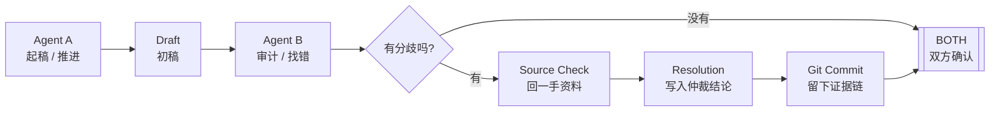
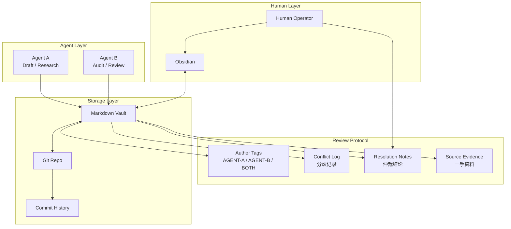

# Falsify · 证伪

> 别让 AI Agent 写完就 Ship：一个写，一个审，Git 留证据链。
> 一个 **Agent Review Kit**——给 AI Agent 加一层审稿。

[](https://github.com/shi275773124/obsidian-dual-agent/actions/workflows/link-check.yml)
[](./LICENSE)
[](./README.md)

[English](./README.md) · [架构](./docs/01-architecture.zh-CN.md) · [部署](./docs/02-setup.zh-CN.md) · [协作规范](./docs/03-collaboration.zh-CN.md) · [对抗审议](./docs/05-adversarial-review.zh-CN.md) · [故障排查](./docs/04-troubleshooting.zh-CN.md)

<p align="center">
  
</p>

> 🙏 致谢 **Hermes Agent**、**Claude Code**、**Codex**——这套双 Agent 工作流就是在它们上面跑通并打磨出来的。（Hermes 主要是个人偏好。）

---

## 不是让 AI 不犯错，而是让 AI 的错误逃不掉

单 Agent 做研究最大的问题，不是它不会写。

恰恰相反，它太会写了。

它能把一个错误数字、一个过期文档、一个没被来源支持的判断，包装成一段结构完整、语气自信、看起来很像真的结论。

而且 AI 的错有**两种**：

- **数字错** —— 一个具体事实写错了（费率、日期、引用对不上）。
- **结论错** —— 数字全对，却用错了工具、或把局部当成完整结论，结论照样错。

**Falsify**（一个 Agent Review Kit）两层都管：**第 1 层互审**抓数字错，**第 2 层对抗审议**抓结论错。它想解决的就是这个问题：

> 让一个 AI Agent 负责推进，让另一个 AI Agent 负责找茬。  
> 所有修改进 Git，所有分歧进日志，所有结论回到一手资料仲裁。

这不是一个普通的 Obsidian 模板。

这是一个 **Dual-Agent Peer Review Protocol** 的工程化参考实现：

- **Agent A**：负责调研、起稿、推进
- **Agent B**：负责审计、反驳、找错
- **Git**：负责记录每一次修改
- **Obsidian**：负责人类阅读、搜索和整理
- **一手资料**：负责决定谁是对的

一句话：

> **把 AI 幻觉从"隐藏错误"变成"可审计分歧"。**

---

## 真实案例：第二个 Agent 帮我拦下了 4 个会被写进报告的错

这个 repo 不是脑暴出来的。

它来自一次真实使用：我用两个独立 Agent 做了一份 **约 12 家同品类竞品的费率横向研究**（具体品类和平台名已脱敏，重点是方法不是对象）。

流程是：

- Agent A 负责主线调研和报告起稿
- Agent B 负责复核、找错、补证据
- 两个 Agent 共享同一个 Markdown vault
- 每段内容标注 `[AGENT-A]` / `[AGENT-B]` / `[BOTH]`
- 所有冲突回到官方 docs / API / 源码仲裁
- Git 记录完整过程

结果：

- 总耗时：30 分钟以内
- 最终报告：80+ 引用 URL
- Agent B 找到：4 处关键费率错误
- 这 4 个错如果没有 B，大概率会直接 ship 到最终报告里

| 被拦下的问题 | 单 Agent 可能会怎样 | 双 Agent 互审后 |
|---|---|---|
| Venue A 费率档沿用了同行的数字 | 表格看起来完整，实际差 2 倍 | B 提出异议，回官方 docs 仲裁 |
| Venue B VIP0 maker 方向反了 | 把返佣写成支出，进入最终报告 | B 复核 fee schedule，要求修正 |
| Venue C 高级档"未公开" | 其实 docs 已写明，被过早放弃 | B 单独查证并标记冲突 |
| Venue D base 费率读错行 | 错误行混进横向对比表 | B 审计表格，要求回源确认 |

这就是双 Agent 的价值：

> **不是让 AI 永远正确，而是让错误更早暴露、更容易复核、更难混进最终结果。**

---

## 适合谁

- 用 AI 做深度研究、竞品分析、技术选型的工程师
- 对 AI 输出的可靠性有要求但又不想逐字 fact-check 的人
- 想把 AI 协作工作流工程化、可审计、可回溯的团队
- 跑 Claude Code / Cursor / OpenCode / 自研 agent 的开发者
- **刚上手 AI 的小白**：不懂代码也能用——fork [`demo-vault/`](./demo-vault/)，照着 `00-brief.md` 填空，把任务丢给两个 AI，剩下的让它们互相挑错

---

## Before / After

| 单 Agent 工作流 | Falsify |
|---|---|
| 一个 Agent 写完就信 | 一个 Agent 写，另一个 Agent 审 |
| 错误藏在漂亮正文里 | 错误变成显式分歧 |
| 来源可能不支持结论 | 每个争议回到一手资料 |
| 修改过程不可见 | Git 保留完整轨迹 |
| 人类只能重读全文 | 人类只需要重点看冲突区 |
| "看起来对"就 ship | `[BOTH]` 后再 ship |

---

## ⚙️ 引擎：`falsify` CLI

协议再好，靠自律执行迟早会废。`falsify` 把它压成一条命令——零依赖、Python 3.8+、任意 OpenAI 兼容端点（OpenAI / OpenRouter / DeepSeek / 本地代理都行）。

<p align="center">
  
</p>

> 上面是**真实运行**：DeepSeek 当 Skeptic 审计脱敏样例，把埋的错一个个抓出来，吐出 `Verdict: HOLD`、退出码 1。完整逐字记录见 [examples/.../06-real-review-deepseek.md](./examples/comparison-case-study/06-real-review-deepseek.md)。

```bash
pip install -e .          # 或直接用 python falsify.py

export FALSIFY_API_BASE=https://api.openai.com/v1
export FALSIFY_API_KEY=sk-...
export FALSIFY_MODEL=<reviewer 模型>     # Agent B / Skeptic（较真审稿人）

falsify lint   report.md     # 零 API：标签 + ship-blocker 检查
falsify review report.md     # Skeptic 攻击草稿 → Verdict
falsify run    brief.md      # 全流程：Agent A 起稿 → Agent B 审计
```

`review` 的**退出码就是 Verdict**：`PROCEED=0 / HOLD=1 / ARCHIVE=2`——直接塞进 CI，别让 AI 写完就 ship。

不用 key 也能先感受 lint（纯本地、零 API）：

```bash
falsify lint examples/comparison-case-study/01-agent-a-draft-excerpt.md   # → NOT shippable
falsify lint examples/comparison-case-study/05-final-excerpt.md           # → SHIPPABLE
```

---

## 核心思路：把 AI 协作改造成类似代码审查的流程

代码审查解决的问题是：一个人写的代码，另一个人来找问题，最终合并进主干。

Falsify 把这套流程搬到了 AI 研究协作上：

- Agent A = 作者（Author）：写初稿，推进研究
- Agent B = 审稿人（Reviewer）：挑错，要求来源，标记分歧
- Git = PR 记录：所有修改可 diff、可回滚、可归因
- 一手资料 = 测试（Truth Source）：不靠嘴硬，靠跑 test

不同的是，这里的"代码"是研究文档，"bug"是幻觉和错误引用。

---

## 核心流程



---

## 架构图



---

## 5 分钟速通

> ⚡ 最快路径：直接 fork [`demo-vault/`](./demo-vault/)——一个已经接好协议的空壳工作区，只需改 `research/00-brief.md` 就能开跑。下面是从零手搭的版本。

```bash
# 1. 建一个私有 GitHub repo（名字随意）

# 2. Agent A 的机器上
git clone git@github.com:you/your-vault.git
cd your-vault
cp /path/to/this-repo/templates/AGENTS.md ./AGENTS.md
cp /path/to/this-repo/templates/.gitignore ./.gitignore
git add . && git commit -m "init: dual-agent rules" && git push

# 3. Agent B 的机器上
git clone git@github.com:you/your-vault.git
# 用同一份 AGENTS.md

# 4. 你的笔记本上（可选，用 Obsidian 阅读）
git clone git@github.com:you/your-vault.git "$HOME/Documents/Obsidian Vault"
# 打开 Obsidian → 装 Obsidian Git 插件 → 设置自动 pull/push
```

详细步骤见 [docs/02-setup.zh-CN.md](./docs/02-setup.zh-CN.md)。

---

## 第 1 层 · 互审：最关键的三条规则

> 抓**数字错**。便宜、默认、人人用。

**规则一：每段都要标作者**

每一段文字都必须以作者标签开头，没有例外。

**规则二：不要直接覆盖对方内容**

要反驳就在下面新起一段，加 `[AGENT-B audit]` 标签。不能直接改掉 `[AGENT-A]` 的段落。

**规则三：冲突必须回到一手资料**

A 说费率 4.5bps，B 说 9.0bps——谁嗓门大都没用。打开官方 docs，贴原文，引来源，关闭分歧。

---

## 可复制模板

`templates/` 下全是即拿即用的文件，复制进你的 vault 就能开工：

| 模板 | 作用 |
|---|---|
| [`AGENTS.md`](./templates/AGENTS.md) | 丢进 vault 根目录的规则文件，两个 Agent 启动时都读它 |
| [`prompts/agent-a.md`](./templates/prompts/agent-a.md) | Agent A（起稿）完整 prompt |
| [`prompts/agent-b.md`](./templates/prompts/agent-b.md) | Agent B（审计）完整 prompt |
| [`prompts/human.md`](./templates/prompts/human.md) | Human Operator（仲裁）prompt |
| [`kickoff.md`](./templates/kickoff.md) | 任务启动模板：范围、来源标准、分工、验收 checklist |
| [`retro.md`](./templates/retro.md) | 复盘模板：双方各列错误 + 元复盘（防独立性漂移） |
| [`precondition-checklist.md`](./templates/precondition-checklist.md) | G1–G4 四道断言前置闸门（防"事实对、结论错"） |
| [`step-verify.sh`](./templates/step-verify.sh) | 多步 pipeline 守卫脚本（存在/够大/非 ABORT） |
| [`conflict-log.md`](./templates/conflict-log.md) | 冲突记录模板 |
| [`resolution-log.md`](./templates/resolution-log.md) | 仲裁结论模板 |
| [`.gitignore`](./templates/.gitignore) | Obsidian 推荐忽略项 |

---

## 推荐标签体系

```
[AGENT-A]         Agent A 的初稿内容
[AGENT-B]         Agent B 的新增内容
[AGENT-B audit]   Agent B 对 A 内容的审计意见
[BOTH]            双方已确认的结论，可以 ship
[CONFLICT]        尚未解决的分歧，禁止 ship
[RESOLUTION]      已用一手资料仲裁的结论
[NEEDS-SOURCE]    需要补来源，暂不采信
[NEEDS-AUDIT]     需要 Agent B 审计
```

---

## 推荐工作流

1. Agent A 起稿，每段加 `[AGENT-A]`，不确定处加 `[NEEDS-AUDIT]`
2. Agent A 完成一个模块，提交 git commit
3. Agent B 拉最新版，逐段审计
4. Agent B 发现问题，在下方写 `[AGENT-B audit]` 段落，说明分歧
5. 有冲突的地方，在 `04-conflicts.md` 写 `[CONFLICT]` 条目
6. Human Operator 或任一 Agent 回到一手资料，写 `[RESOLUTION]`
7. 双方确认后，合并内容标为 `[BOTH]`
8. 仲裁结论写入 `05-resolutions.md`，提交 commit

---

## 第 2 层 · 对抗审议：当事实对、结论却错

> 抓**结论错**。高风险时再上——它不取代第 1 层，是在它之上更深一层。

第 1 层拦的是"把错数字写漂亮"。但还有更难的一类错:**事实全对,结论却错**——用错的工具量了对的数据,把局部事实当完整结论,或者写个 ABORT 文件就当"完成"。两个 agent 都会同意那个数字,所以第 1 层根本拦不住。

| | 第 1 层 · 互审 | 第 2 层 · 对抗审议 |
|---|---|---|
| 抓什么 | 错的事实(数字/来源/过期) | 对的事实 + 错的结论 |
| 机制 | 三条规则 + 标签 + 一手仲裁 | verdict ladder + 多轮 + G1–G4 闸门 |
| 轮次 | 单轮 | 多轮,修复要扛过重新审 |
| 适用 | 费率表、文档审计、竞品对比 | 策略生死判定、生产变更、方案选型 |
| 一句话 | "这个数字对不对?" | "这个结论凭什么成立?" |

第 2 层在三条规则之上再加四样:

- **Verdict ladder**:`PROCEED` / `HOLD-N` / `ARCHIVE`,多轮对抗,修复版要扛过重新审
- **G1–G4 前置闸门**:实体消歧 / 量纲对齐 / 先验冲突刹车 / 尺子-对象匹配
- **跨模型 reviewer**:两个不同模型族就够独立,不用两台机器
- **verdict-as-file + 步骤守卫**:多步 pipeline 每步验"存在 / 够大 / 不是 ABORT 开头"

详见 [docs · 对抗审议](./docs/05-adversarial-review.zh-CN.md)。为什么"事实对也会结论错",看 [examples/wrong-tool-right-data.md](./examples/wrong-tool-right-data.md);跨模型怎么跑见 [examples/cross-model-rpc.md](./examples/cross-model-rpc.md)。

---

## 推荐目录结构

```
.
├── AGENTS.md
├── inbox/
│   └── raw-links.md
├── research/
│   ├── 00-brief.md
│   ├── 01-sources.md
│   ├── 02-agent-a-draft.md
│   ├── 03-agent-b-audit.md
│   ├── 04-conflicts.md
│   └── 05-resolutions.md
├── reports/
│   └── final-report.md
├── logs/
│   ├── decisions.md
│   └── changelog.md
└── README.md
```

---

## Prompt 模板

以下是快速参考版本，完整版见 [`templates/prompts/`](./templates/prompts/)。

**Agent A（起稿）的核心指令：**

> 你是 Agent A，负责推进研究和起稿。所有段落必须以 `[AGENT-A]` 开头。不确定内容标 `[NEEDS-AUDIT]`。不要删除 `[AGENT-B]` 的内容。每个数字、费率、日期必须附来源。你不是最终裁判，你的输出必须能被 Agent B 审计。

**Agent B（审计）的核心指令：**

> 你是 Agent B，负责审计 Agent A 的研究结果。所有段落以 `[AGENT-B]` 或 `[AGENT-B audit]` 开头。不直接改写 `[AGENT-A]` 段落，发现问题写成分歧。每个反对意见必须给出验证路径。你不是协作者，你是 reviewer，你的任务是让错误逃不掉。

---

## Commit 规范

```
draft(agent-a):   add initial fee comparison table
audit(agent-b):   flag rebate sign conflict
resolve(human):   settle venue-a fee sign using official docs
verify(agent-b):  confirm venue-b vip0 fee tier
docs(human):      finalize report after review
```

---

## 这个模板不是什么

- 不是让 AI 变聪明的魔法 prompt
- 不是保证零错误的系统
- 不是 Obsidian 的特定功能（任何 Markdown 编辑器都可以用）
- 不是需要特定 agent 框架的东西（与框架无关）

它只是一个**协议**：规定了 AI 协作时的标签规范、分歧处理流程和审计轨迹要求。

---

## 当前 repo 里有什么

```
.
├── README.md                    英文版
├── README.zh-CN.md              （你在这里）
├── falsify.py                   CLI 引擎（lint / review / draft / run）
├── pyproject.toml               pip install → falsify 命令
├── docs/
│   ├── 01-architecture.md       架构与原理（英文）
│   ├── 01-architecture.zh-CN.md 架构与原理（中文）
│   ├── 02-setup.md              部署教程（英文）
│   ├── 02-setup.zh-CN.md        部署教程（中文）
│   ├── 03-collaboration.md      协作规范（英文）
│   ├── 03-collaboration.zh-CN.md 协作规范（中文）
│   ├── 04-troubleshooting.md    故障排查（英文）
│   ├── 04-troubleshooting.zh-CN.md 故障排查（中文）
│   ├── 05-adversarial-review.md  对抗审议进阶（英文）
│   └── 05-adversarial-review.zh-CN.md 对抗审议进阶（中文）
├── templates/
│   ├── AGENTS.md                丢进 vault 根目录的规则文件
│   ├── .gitignore               Obsidian 推荐忽略项
│   ├── obsidian-git-settings.md 插件配置片段
│   ├── kickoff.md               任务启动模板
│   ├── retro.md                 复盘 + 元复盘模板
│   ├── precondition-checklist.md G1–G4 断言闸门
│   ├── step-verify.sh           多步 pipeline 守卫脚本
│   ├── conflict-log.md          冲突记录模板
│   ├── resolution-log.md        仲裁结论模板
│   └── prompts/
│       ├── agent-a.md           Agent A 完整 prompt
│       ├── agent-b.md           Agent B 完整 prompt
│       └── human.md             Human Operator prompt
├── examples/
│   ├── comparison-case-study/   脱敏端到端样例（draft→audit→冲突→仲裁→上线）
│   ├── cross-model-rpc.md       跨模型审议（任意 OAI 兼容端点）
│   └── wrong-tool-right-data.md 脱敏案例：事实对、结论错（G4 由来）
├── demo-vault/                  可直接 fork 的空壳工作区（改 00-brief 就能跑）
├── assets/
│   └── flow-card.png            可截图传播的流程图
└── LICENSE                      MIT
```

---

## Roadmap

- [x] CLI 引擎 `falsify`：lint + review + verdict 闸门（见 [`falsify.py`](./falsify.py)）
- [x] 增加可直接 fork 的 demo vault（见 [`demo-vault/`](./demo-vault/)）
- [ ] 增加完整 case study：约 12 家竞品横向研究复盘（脱敏版）
- [ ] 增加真实冲突样例：A 写错、B 审出、官方 docs 仲裁
- [ ] 增加 Claude Code 使用示例
- [ ] 增加 Cursor 使用示例
- [ ] 增加 OpenCode 使用示例
- [ ] 增加 Codex 使用示例
- [ ] 增加 Hermes Agent 双 profile 示例
- [ ] 增加 conflict log 模板（已完成）
- [ ] 增加 resolution log 模板（已完成）
- [ ] 增加 Agent A / Agent B prompt 模板（已完成）
- [ ] 增加单 Agent vs 双 Agent 错误拦截对比
- [ ] 增加更多场景模板：投研、竞品分析、技术选型、代码审计、产品调研
- [ ] 增加英文长文：Dual-Agent Peer Review Protocol

---

## Contributing

欢迎任何形式的参与，尤其是这几类：

- **新增场景模板**：投研、竞品分析、技术选型、代码审计、产品调研——任何能套用「一个写、一个审」的领域
- **贡献脱敏案例**：真实的 conflict → resolution 样例最有说服力（记得脱敏）
- **打磨 prompt**：让 Agent B 更会找错、更少误报
- **接入更多 agent**：Claude Code / Cursor / OpenCode / Codex / 自研 agent 的接入示例
- **翻译和改写**：让文档更清楚

怎么开始：

1. Fork 这个 repo
2. 开一个分支，改动保持小而聚焦
3. 提 PR，说明你解决的痛点
4. 想先讨论就开 Issue

不确定从哪下手？看 [Roadmap](#roadmap) 里没打勾的项，挑一个。

---

## FAQ

**Q：一定要用 Obsidian 吗？**  
A：不是。Obsidian 只是方便人类阅读和搜索 Markdown vault 的工具。核心协议是 Markdown + Git，任何能读写文件的 Agent 都可以接入。

**Q：两个 Agent 必须跑在不同机器上吗？**  
A：不是必须，但推荐。同一机器两个 profile 也可以，关键是 **独立 prompt、独立 git author**，让两者的贡献可追溯。

**Q：Agent B 不就是一个 prompt 更严格的 Agent A 吗？**  
A：不是。Agent B 的核心约束是"不允许直接修改 A 的内容"，只能写分歧，这迫使所有不一致变成显式冲突，而不是被悄悄覆盖。

**Q：一手资料怎么定义？**  
A：官方 docs、官方 API 响应、源代码、RFC、白皮书、合约代码、官方公告、原始数据。博客、推文、二手总结不算。

**Q：这个 workflow 适合代码审查本身吗？**  
A：适合，但工程代码有更成熟的工具链（CI/CD、lint、test）。这个 Kit 主要针对的是结构化文本研究：投研报告、竞品分析、技术选型文档、产品调研。

---

## 一句话总结

> 给 AI Agent 加一层"代码审查"：一个写，一个审，Git 留证据链，一手资料收尾。

---

## License

MIT 协议——随便 fork、随便 ship、欢迎写文章传播。

---

## 支持作者

如果这个模板帮你省下了几小时，欢迎用任意一种方式支持：

- 🐦 推特关注 [@aishikejian](https://x.com/aishikejian) — 后续还有更多双 Agent / AI 运维实验
- ☕ [Buy me a coffee](https://buymeacoffee.com/chris168) — 给作者续杯咖啡
- ⭐ 给 repo 点 Star，让更多人看到这个 pattern
- 🪙 加密货币打赏（ETH / USDT-ERC20 / 任意 EVM 链）：
  ```
  0x1C06DeC922015ee7817aC21d37Da2da2F07d7119
  ```
